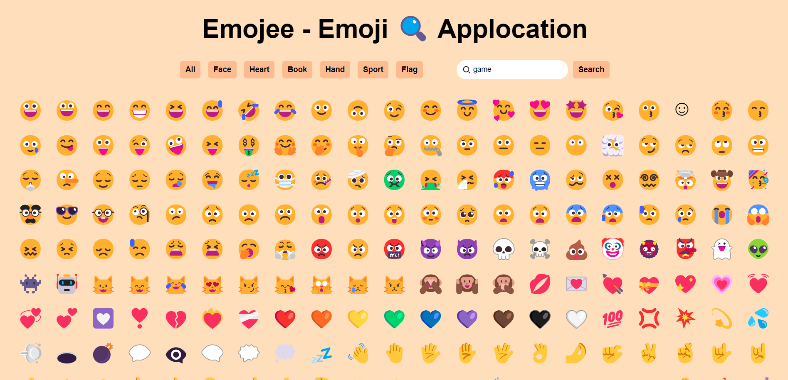
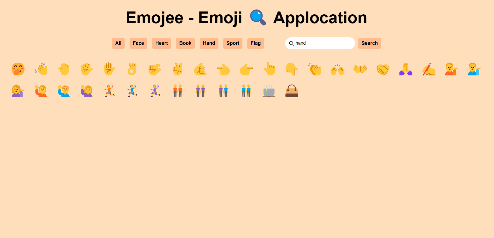
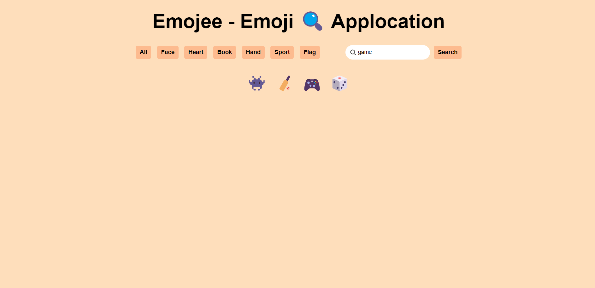

# Emojee - Emoji Application 🕵️‍♂️

An interactive emoji application where users can browse, filter, and search emojis by categories like "Face," "Heart," "Book," "Hand," "Sport," and "Flag." The app also allows users to copy emojis to the clipboard with a single click.


## Live Demo

[Link to the live demo]()

## Features

- **Emoji Categories**: Filter emojis by categories like Face, Heart, Book, Hand, Sport, and Flag.

- **Search Functionality**: Search for emojis by keywords (e.g., "smile," "happy").

- **Copy Emoji**: Click on an emoji to copy it to your clipboard.

- **Responsive Design**: User-friendly layout for both desktop and mobile devices.

## Technologies Used

- **HTML**: Structure of the web page.

- **CSS**: Styling for a clean, visually appealing UI.

- **JavaScript**: Core functionality for filtering, searching, and copying emojis.


## How to Use

- **Filter by Category**: Click on any category button (e.g., "Face," "Heart") to display only emojis in that category.

- **Search for Emoji**: Type a keyword in the search box and click "Search" to find emojis related to your keyword.

- **Copy Emoji**: Click on any displayed emoji to copy it to your clipboard.

## Project Structure
```
.
├── index.html           # Main HTML file
├── style.css            # Styling for the application
├── script.js            # JavaScript file with emoji functionality
└── README.md            # Project documentation
```

## Copy Emoji Functionality

A simple event listener to copy the selected emoji to the clipboard:
```
emojiContainer.addEventListener("click", (e) => {
    navigator.clipboard.writeText(e.target.innerText);
    alert("Copied to clipboard");
});
```

## Installation and Setup

1 . **Clone the Repository**:

```
git clone https://github.com/yourusername/emoji-app.git
cd emoji-app
```

2 . **Open the Project**: Open index.html in your preferred browser.

3 . **Start Browsing Emojis**: Use the category buttons or search feature to filter emojis.


## Future Improvements

- **Additional Categories**: Add more categories or subcategories for emojis.

- **Advanced Search**: Improve the search to handle multiple keywords or use fuzzy matching.

- **Emoji Details**: Show additional details on hover, such as description and aliases.


**Here is a screenshot of the application:**

1. For All

   

2. For Hand

   

3. For Game

   

If you have any questions, feel free to contact me at **ajeetrana520@gmail.com**.