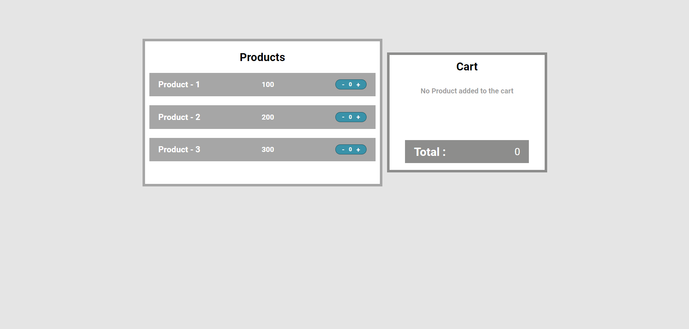
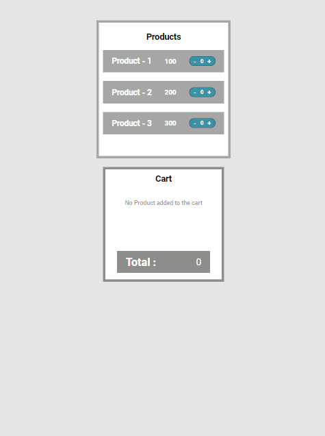
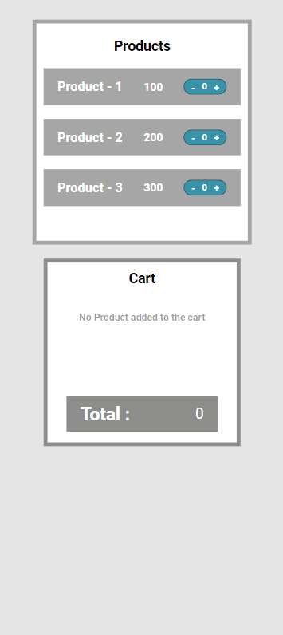

# Product Cart Project

A simple product cart application built with HTML, CSS, and JavaScript. Users can add or remove products from their cart, view quantities, and see the total price update in real time.

## Features

- Display a list of available products with prices.
- Users can add products to the cart using the "+" button and remove them using the "-" button.
- Shows the quantity of each product in the cart and the total price.
- Responsive design: works well on desktop, tablet, and mobile devices.
- If no products are in the cart, displays a message saying "No Product added to the cart."

## Live Demo

[Link to the live demo](https://azit-rana0.github.io/Assignment-with-JS/productCart/index.html)

## Technologies Used

- **HTML5**: Structure of the webpage
- **CSS3**: Styling and responsive design
- **JavaScript**: Handling the cart logic and DOM manipulation

## Getting Started

### Prerequisites

To run the project locally, you only need a web browser.

### Installation

1. Clone the repository or download the ZIP file:
   ```bash
   git clone https://github.com/azit-rana0/Assignment-with-JS/tree/main/productCart

2. Navigate to the project directory:
    ```bash
   cd productCart

3. Open the index.html file in your browser to run the application.

## Usage

1. View the product list on the left side and an empty cart on the right.
2. Click the "+" button next to a product to add it to the cart.
3. Click the "-" button next to a product to remove it from the cart.
4. The cart will update automatically, showing quantities and the total price.

## Project Structure
    ```bash
    productCart/
    │
    ├── index.html       # Main HTML file
    ├── styles.css       # CSS file for styling
    ├── script.js        # JavaScript file for cart functionality
    ├── assets/          # Folder for images and screenshots
    │   └── screenshot-laptop.png  # Screenshot for laptop view
    │   └── screenshot-tablet.png  # Screenshot for tablet view
    │   └── screenshot-mobile.png  # Screenshot for mobile view
    └── README.md        # Project description and instructions

## Screenshots
**Here is a screenshot of the application:**

1. In laptop

   

2. In Tablet

   

3. In Mobile

   

## Contact

If you have any questions, feel free to contact me at ajeetrana520@gmail.com.


